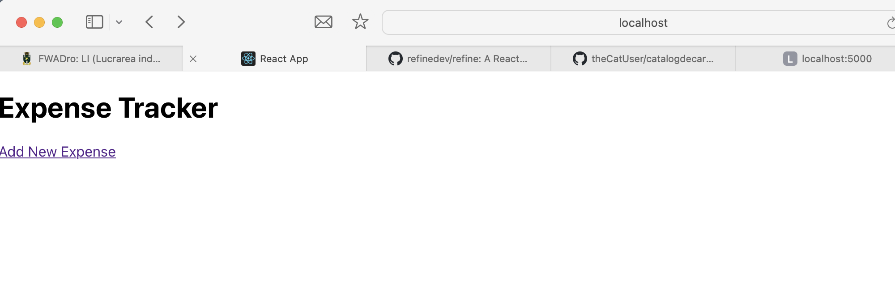
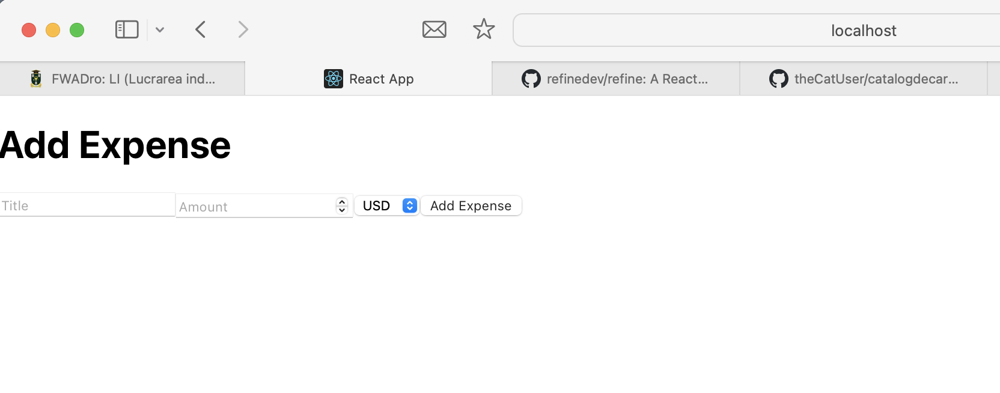
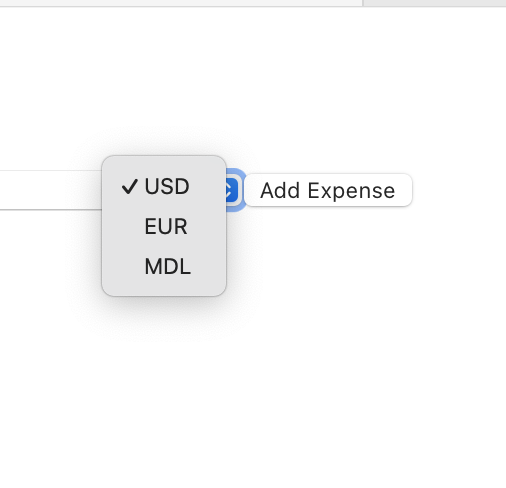
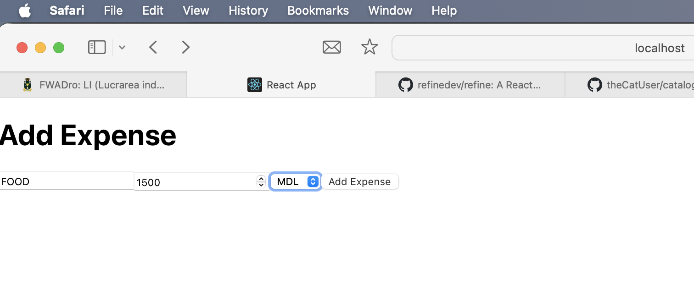

README - Expense Tracker App

1. Instrucțiuni privind instalarea și pornirea proiectului

Proiectul necesită instalarea Node.js și MongoDB. După clonarea repository-ului, backend-ul și frontend-ul trebuie instalate separat prin comenzi pentru 
instalarea dependențelor. Este important să configurăm variabilele de mediu în backend pentru conexiunea la baza de date și cheile de securitate. 
Pornirea aplicației implică rularea backend-ului și frontend-ului, care vor comunica între ele.

2. Descrierea proiectului

Scopul aplicației
Expense Tracker App este o aplicație web care permite utilizatorilor să își monitorizeze și să gestioneze cheltuielile zilnice. 
Scopul principal este de a oferi o soluție intuitivă pentru urmărirea bugetului personal și organizarea cheltuielilor.

Funcționalități principale

Adăugarea cheltuielilor: Utilizatorii pot adăuga informații despre cheltuieli (titlu, sumă, categorie).
   
Vizualizarea cheltuielilor: O listă a tuturor cheltuielilor este afișată pentru o vizualizare rapidă.
Sortare și filtrare: Utilizatorii pot sorta sau filtra cheltuielile după categorii sau sumă. 
Autentificare și autorizare: Accesul la aplicație este securizat prin autentificare cu token JWT.
CRUD complet: Utilizatorii pot crea, citi, actualiza și șterge cheltuieli.

3. Exemple de utilizare ale proiectului

Aplicația permite adăugarea unei cheltuieli printr-un formular în care utilizatorul completează informații precum titlu, sumă și categorie. 
Cheltuielile sunt afișate într-o listă, fiecare înregistrare având detalii relevante. Funcționalitatea de sortare și filtrare ajută utilizatorii să 
analizeze mai eficient datele introduse.

4. Lista surselor utilizate

În dezvoltarea proiectului, s-au utilizat:

Documentația oficială a React.js și Node.js.
Resurse online precum Stack Overflow și articole de blog tehnice.
Librării și framework-uri externe: Axios pentru apelurile API, react-router-dom pentru navigare și bcrypt pentru gestionarea parolelor.